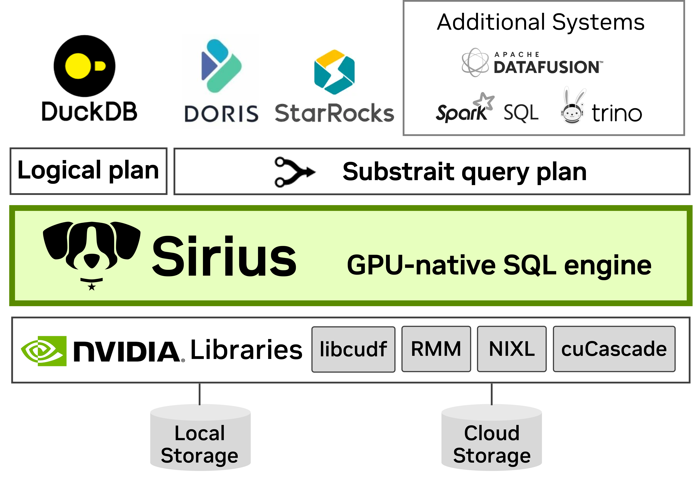

# Sirius GPU-native SQL engine 

It plugs into existing databases such as DuckDB via the standard Substrait query format, requiring no query rewrites or major system changes. By offloading query execution to GPUs, Sirius achieves over 10× speedup at the same hardware rental cost!

## Demo

1. [Setup](setup.sh)
2. [Queries](queries.md)
3. [Results](results.txt)

# GPU Day 2026

GPU Day is an annual one-day expo hosted by ASU Research Computing to educate faculty, students, and staff on how to use graphic processing units (GPUs) on the Sol supercomputer. The intent is to inspire and motivate our research community to use Research Computing's supercomputing systems and to showcase the important applications of these powerful GPU resources. 

This event will include in-depth and interactive training for unleashing the potential of GPUs and AI in software acceleration, harnessing large language models (LLMs), and tutorials with special guests from NVIDIA.

Monday, April 20th  
8:00 a.m. - 5:00 p.m.
 
Biodesign Auditorium  
727 E. Tyler St., Tempe, AZ 85281

